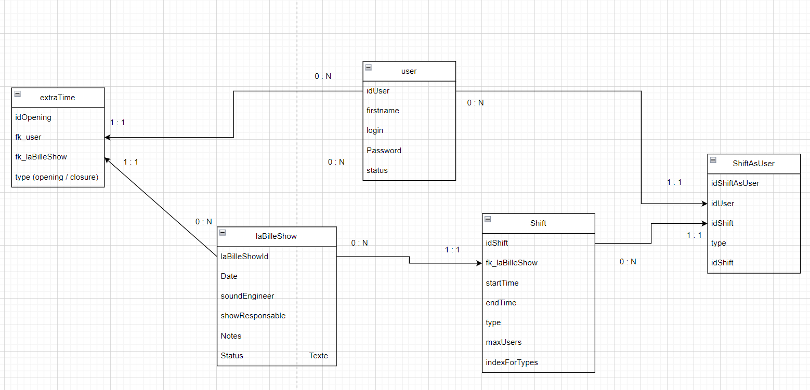

Gestion des Bénévoles - Espace Culturel

Description

Cette application a pour but de faciliter la gestion des bénévoles dans un espace culturel qui organise des concerts et des événements en tout genre. Tout le fonctionnement repose sur l'engagement des bénévoles, qui peuvent s'inscrire et gérer leurs disponibilités à travers une interface intuitive et accessible.

Les fonctionnalités clés incluent :

Interface utilisateur simple : conçue pour minimiser les efforts des bénévoles lors de leur inscription et leur gestion.

Vision centralisée : destinée aux superviseurs, pour un aperçu global des disponibilités et des affectations.

Gestion des événements : coordination des équipes pour chaque événement, simplifiant la logistique.

Statut du Projet

:warning: Le code est actuellement en pleine refactorisation et le développement de l'application n'est pas encore terminé. Certaines fonctionnalités peuvent être incomplètes ou sujettes à modifications.

Voici dans l'ordre de priorités les  :

Création du frontend en React Typescript

Refactorisation générale mais principalement du Backend

L'ergonomie de l'interface utilisateur.

